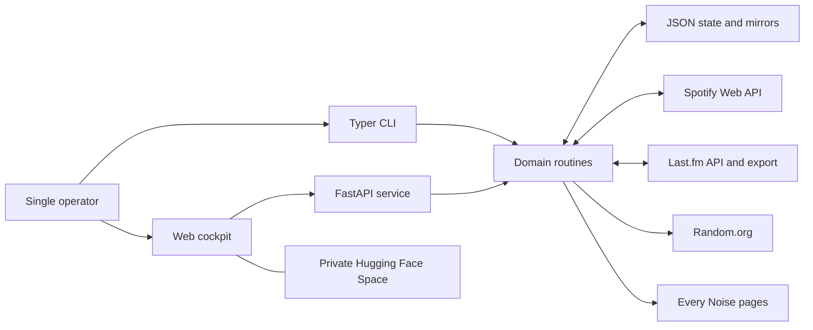
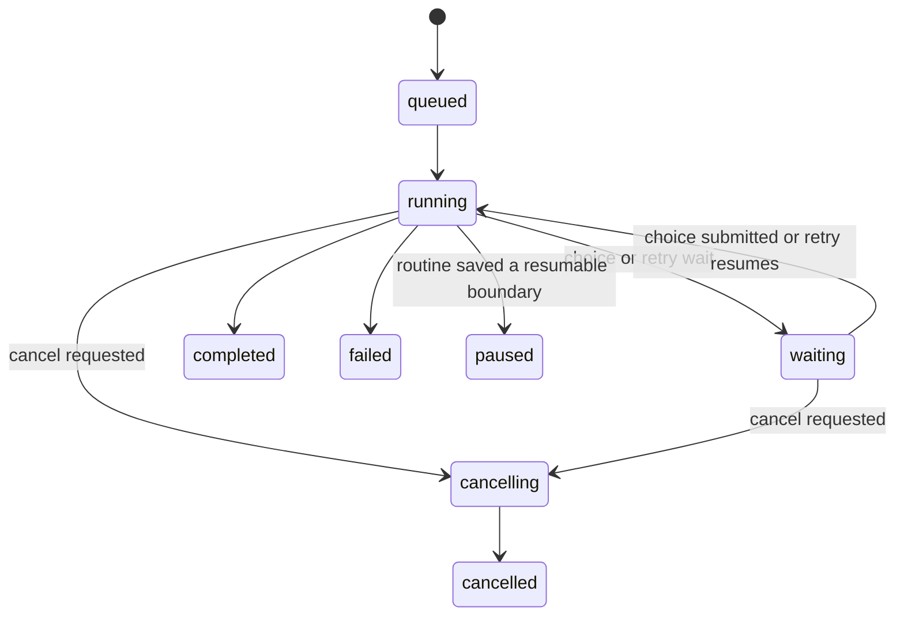
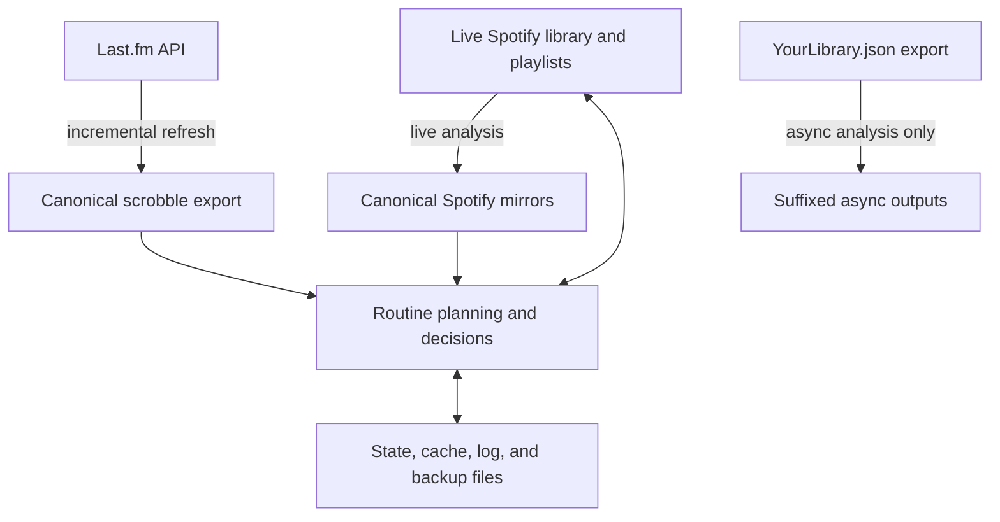

# Architecture

## Purpose and boundaries

Spotify Manager is a single-user application that turns a personal listening
policy into cautious Spotify and Last.fm workflows. It is intentionally a
modular monolith:

- one Python package contains the interfaces and domain routines;
- one process serves the web UI and API;
- local JSON and JSON-lines files provide mirrors, checkpoints, and audit logs;
- Spotify remains authoritative for the live library and playlists;
- Last.fm remains authoritative for scrobbles; and
- there is no database or external task queue.

The named behaviors come from
[`THE RULES OF MUSIC LISTENING.md`](../THE%20RULES%20OF%20MUSIC%20LISTENING.md).
The code adds operational safeguards such as dry runs, idempotency checks,
atomic state writes, resumability, retries, and audit logs.

## System context



## Runtime surfaces

### CLI

`spotify_manager/main.py` defines the Typer application installed as
`spotify-manager`. It owns terminal rendering and interactive prompts, then
delegates work to functions in `spotify_manager/routines/`.

CLI commands use Rich for progress, tables, status messages, and cautious
confirmation. Each public Typer command has a same-named recipe in `justfile`.
The recipe forwards arguments without changing them.

```text
just flush-new-wine --dry-run
        |
        v
uv run spotify-manager flush-new-wine --dry-run
        |
        v
main.py prompt/render adapter
        |
        v
routines/new_wine.py
```

### Pure API

`spotify_manager/api.py` creates `spotify_manager.api:app`. It exposes live
lookups, legacy maintenance endpoints, and background-job adapters for the
interactive routines. Pydantic response models make the job protocol explicit.

The pure API does not add the shared-password middleware or serve the frontend.
It is intended for loopback development, tests, or another trusted wrapper.

### Web deployment wrapper

`spotify_manager/web.py` imports the same FastAPI application and adds:

- `PasswordMiddleware`, using the `X-App-Password` request header;
- the responsive cockpit at `/`;
- the standalone Genre Reveal route at `/genre-reveal`; and
- server-side Genre Reveal state endpoints.

The web entry point is `spotify_manager.web:app`. The Docker container starts it
through `start.sh` on port 7860.

### Frontend

`spotify_manager/frontend/index.html` is a dependency-free single-page control
cockpit. Its modules group related routines and poll the API for progress,
choices, results, and terminal-style logs. It reconnects to active in-process
jobs after a browser reload.

`spotify_manager/frontend/genre-reveal.html` is the preserved Every Noise
nearest-neighbor route with server-backed completion state.

## Internal layers

| Layer | Location | Responsibility |
| --- | --- | --- |
| Configuration | `spotify_manager/settings.py` | Parse `.env` and process environment values with Pydantic Settings. |
| Authentication and clients | `spotify_manager/client/`, `spotify_manager/_auth.py` | Spotify OAuth, credential rotation, Last.fm HTTP calls, and web password enforcement. |
| Interface adapters | `spotify_manager/main.py`, `spotify_manager/api.py`, `spotify_manager/web.py` | Parse user input, render output, manage web jobs, and translate errors to interface responses. |
| Domain routines | `spotify_manager/routines/` | Plan and execute playlist, library, recommendation, analysis, and recovery workflows. |
| Processors | `spotify_manager/processors/` | Shared library transformations, lookups, statistics, and legacy reconciliation. |
| Models | `spotify_manager/models/` | Pydantic models for exports, mirrors, lookups, albums, artists, tracks, and statistics. |
| Persistence helpers | `spotify_manager/loaders_savers/` | Load and save canonical and legacy JSON files. |
| Utilities | `spotify_manager/utils/` | Sorting, comparison, and growth calculations. |
| Data and runtime state | `spotify_manager/files/` | Exports, mirrors, caches, checkpoints, backups, decisions, and audit logs. |

The interface modules should not reimplement routine rules. Interactive choices
are passed into routines as callbacks in the CLI and as pause/resume state in
the API. This keeps Spotify mutation order, eligibility logic, and persistence
behavior shared between both interfaces.

## Routine families

| Family | Routines |
| --- | --- |
| Library mirrors and recovery | `analyse_library`, `review_album_limits`, `recover_removed_albums`, `review_artists` |
| Last.fm history and recommendations | `scrobble_history`, `found_art`, `sauvignon`, `the_queue`, `something_old`, `release_check` |
| Recovery tracks | `blast_from_past`, `daily_mind_radio` |
| Discovery tracks | `genre_reveal`, `new_kids`, `new_wine`, `queue_3`, plus Queue 2 behavior in `new_kids` |
| Deep listening | `slow_listening`, `something_old` |
| Album cycles | `sauvignon`, `requeue_for_a_dream`, `palace_of_memory` |
| Discography planning | `discography` |
| Legacy maintenance | `monthly_routine`, `convert_library_file`, `count_items` |
| Deployment data transfer | `upload_library_files` |

The [README command reference](../README.md#library-mirror-commands) documents
the user-visible behavior and safety rules for every command.

## Execution model

### Synchronous CLI

The CLI executes a routine in the foreground. A routine can emit progress or
retry events through callbacks and can call a prompt callback when a decision
is required. Interruptible routines save their active state at safe boundaries.

### Threaded web jobs

Long-running web commands are represented by in-memory job objects in
`spotify_manager/api.py` and run in background threads. A typical interactive
job follows this state machine:



The API keeps at most the latest 250 log entries per job in memory. A page
reload can rediscover active jobs through each command's collection endpoint.
A process restart removes the in-memory job object, but routines with durable
state can start again from their last saved boundary.

Only one active job of a given routine is accepted. Attempts to start a second
one return HTTP 409. Choice endpoints wake a paused worker; cancel endpoints set
a cancellation event that is checked at safe boundaries.

### Mutation ordering and idempotency

Playlist transition routines generally add the replacement track before
removing the previous marker. They re-read playlist membership before a live
write and persist completed items after successful mutations. This makes a
retry safer if the process stops between operations.

Dry run is the default in the web cockpit for routines that can substantially
change playlists or library state. The README calls out the few dry runs that
still persist safe metadata, such as Last.fm refreshes or confirmed artist
mappings.

## External integrations

### Spotify

`spotify_manager/client/__init__.py` builds a `RotatingSpotify` client over one
primary app and up to four optional apps (`app5` through `app8`). Every app has
its own `SpotifyOAuth` manager and token cache.

The client requests playlist read/write, library read/write, and follow
read/write scopes. On HTTP 429 it refreshes and activates the next configured
credential set, then retries the same request. GET connection resets and
timeouts receive short exponential retries. Selected routines add their own
cancellable retry policy for Spotify 5xx responses.

The library analyzer controls retries itself: its 5xx backoff starts at 10
seconds and is capped at 30 minutes. In the CLI, a waiting analysis can quit
cleanly or force credential rotation.

### Last.fm

`spotify_manager/client/lastfm.py` provides read-only API access. The canonical
history file is incrementally refreshed from `user.getRecentTracks`; other
routines use Last.fm similarity and popularity data to reconstruct track,
artist, and album recommendations.

Only an API key and username are required. The Last.fm shared secret is not used
because the application does not perform authenticated Last.fm writes.

### Random.org

Blast from the Past, Daily Mind Radio, and Palace of Memory use Random.org
responses as required by the listening rules. They intentionally do not fall
back to a local pseudorandom generator when Random.org is unavailable.

### Every Noise

Genre Reveal parses the preserved Every Noise route and the selected genre page
to find its main Spotify playlist. It saves that playlist and samples tracks
into the configured destination.

### Hugging Face Hub and Spaces

The `huggingface_hub` client uploads refreshed source exports. The production
web app runs in a private Docker Space. The Space repository and its running
container can both hold state newer than GitHub, so deployments use explicit
file lists and state snapshots rather than a blanket repository replacement.

## Data flow and authority



When a focused live lookup is possible, routines prefer Spotify. Canonical
mirrors are used where a complete inventory is required or to reduce API cost.
`YourLibrary.json` is an explicit offline source, not an implicit live fallback.
See [Data and state](DATA_AND_STATE.md) for exact ownership and persistence
rules.

## Repository structure

```text
spotify-manager/
|-- .env.example                 Sanitized local configuration template
|-- Dockerfile                   Hugging Face Docker image
|-- start.sh                     Token-cache seeding and production startup
|-- justfile                     Development and CLI recipe facade
|-- pyproject.toml               Package, dependencies, tools, entry points
|-- uv.lock                      Locked Python dependency graph
|-- README.md                    Quick start and command reference
|-- DEPLOY.md                    Hugging Face operations runbook
|-- docs/                        Architecture and operator guides
|-- spotify_manager/
|   |-- _auth.py                 Shared-password middleware
|   |-- api.py                   FastAPI routes and threaded job adapters
|   |-- main.py                  Typer CLI and Rich prompt adapters
|   |-- settings.py              Pydantic environment settings
|   |-- web.py                   Gated frontend deployment wrapper
|   |-- client/                  Spotify and Last.fm clients
|   |-- frontend/                Cockpit and Genre Reveal HTML applications
|   |-- loaders_savers/          Canonical JSON persistence helpers
|   |-- models/                  Pydantic data models
|   |-- processors/              Shared transformations and lookups
|   |-- routines/                Domain workflows
|   |-- utils/                   Sorting and calculations
|   `-- files/                   Exports, mirrors, and runtime state
`-- tests/                       Unit, CLI, API, web, and routine tests
```

## Security model

- The project is single-user and is not designed for untrusted multi-tenant
  execution.
- The deployed repository must be private because it contains personal library
  and listening-history exports.
- `APP_PASSWORD` protects API requests made through `web.py`, but it is only a
  shared secret, not an identity system.
- `spotify_manager.api:app` has no password middleware. Bind it to loopback or
  place it behind a trusted authentication layer.
- OAuth cache JSON contains refresh tokens with write scopes. It is excluded
  from Git and Docker and supplied to the Space as secrets.
- `.env` and token cache files must never be committed.

## Development workflow

Install the locked environment, then use the existing quality gates:

```console
just install
just format
just test
just lint-mypy
just lint-audit
```

`just test` runs Ruff and the randomized pytest suite with package coverage.
The configured coverage floor is 90 percent. Tests are organized by the same
layers as the package, with additional CLI, API job, auth, and web integration
coverage at `tests/` root.

### Adding or changing a routine

1. Update the listening-rules document when the behavior itself changes.
2. Put domain planning, validation, mutation order, state, and logs in a routine
   module. Keep prompts and HTML out of that layer.
3. Add or update the Typer adapter and its `justfile` recipe.
4. Add API request/response models and a background-job adapter when the routine
   belongs in the web cockpit.
5. Add the cockpit controls, choice rendering, logs, cancellation, and reload
   reconnection behavior.
6. Add routine tests first, then CLI/API/web adapter tests proportional to the
   changed surface.
7. Update the command reference, configuration table, and data/state guide.
8. Run `just test`, then follow the state-preserving deployment runbook.

## Known architectural constraints

- `api.py` contains many job adapters and models in one large module. This is a
  deliberate monolith today, but new cross-routine job behavior should be
  factored into shared helpers rather than duplicated.
- Background jobs and their displayed logs are process-local. Durable routine
  state handles restarts, but there is no distributed worker or job database.
- Runtime persistence is file-based. Concurrent writes outside the application
  locks are unsupported.
- Some legacy maintenance workflows still use `albums_total.json`, control
  files, and `YourLibrary.json`. New focused workflows should use live Spotify
  state unless they require a complete inventory.
