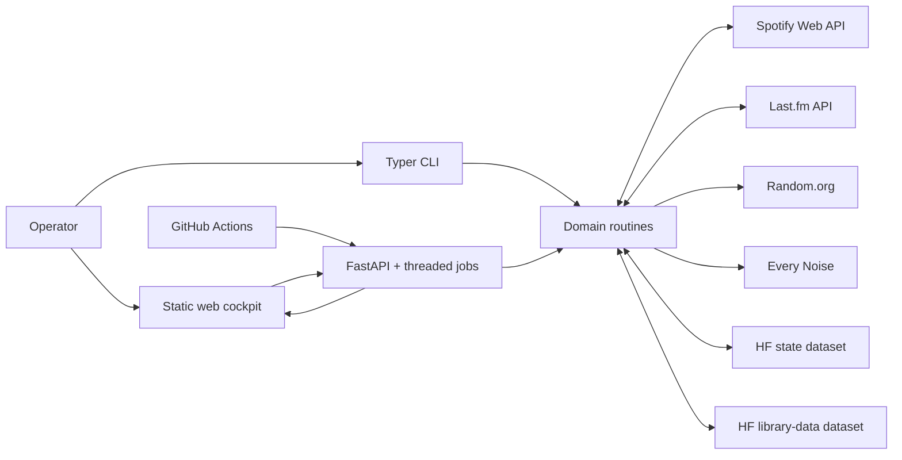

# Architecture Specification

**Status:** implemented, production-deployed modular monolith

**Baseline:** `master` at `a70412e` (2026-09-23)

**Scope:** current code, interfaces, persistence contracts, and known backlog

## 1. Purpose and constraints

Spotify Manager is a single-operator application that applies the policies in
[`THE RULES OF MUSIC LISTENING.md`](../THE%20RULES%20OF%20MUSIC%20LISTENING.md)
to a Spotify library and Last.fm history. One Python package serves three
interfaces: a Typer CLI, a FastAPI service, and a static web cockpit.

The system is intentionally a modular monolith. It has no SQL database, Redis,
external task queue, Node.js build, or multi-user identity layer. Spotify is
authoritative for live library and playlist membership; Last.fm is authoritative
for scrobbles; private Hugging Face datasets are authoritative for application
state and canonical mirror snapshots.

## 2. System topology



Production is a private Docker Hugging Face Space running
`spotify_manager.web:app` on port 7860. GitHub Actions calls the Space API for
scheduled refreshes. CLI and local web executions normally use the same two Hub
datasets as production, so their durable state is shared.

## 3. Module structure

| Location | Current responsibility |
| --- | --- |
| `spotify_manager/main.py` | Typer commands, Rich rendering, CLI prompts, retries, and routine wiring. |
| `spotify_manager/api.py` | FastAPI models/routes, in-memory job registry, worker threads, polling, choices, cancellation, and API error translation. |
| `spotify_manager/web.py` | Password middleware, static frontend routes, and Genre Reveal web endpoints. |
| `spotify_manager/frontend/` | Dependency-free HTML/CSS/JavaScript cockpit and preserved Genre Reveal page. |
| `spotify_manager/routines/` | Business rules, planning, Spotify mutation order, resumability, and audit events. |
| `spotify_manager/client/` | Rotating Spotipy client and read-only Last.fm client. |
| `spotify_manager/core/state/` | Central state document, namespace service, validation, optimistic concurrency, editing, and export. |
| `spotify_manager/core/library_data/` | Canonical artifact manifest, integrity checks, hydrate/publish service, and conflict handling. |
| `spotify_manager/infrastructure/` | Local JSON and Hugging Face adapters for the two core persistence services. |
| `spotify_manager/processors/` | Shared library lookups, transformations, statistics, and legacy reconciliation. |
| `spotify_manager/models/` | Pydantic models for mirrors, exports, lookups, and statistics. |
| `spotify_manager/loaders_savers/` | Canonical and legacy JSON loading/saving compatibility functions. |
| `spotify_manager/utils/` | Sorting, normalized comparisons, and growth calculations. |
| `spotify_manager/files/` | Hydrated mirrors, source exports, caches, staging, backups, and JSONL audit logs. |

The interface modules call routines; they should not reproduce listening rules.
Routines accept callbacks for progress, retry policy, and user choices so CLI
and API behavior share the same mutation logic.

### Routine modules

| Capability | Modules |
| --- | --- |
| Library inventory and repair | `analyse_library`, `review_album_limits`, `review_artists`, `recover_removed_albums` |
| Last.fm history and recommendations | `scrobble_history`, `found_art`, `sauvignon`, `the_queue`, `something_old`, `release_check` |
| Date-based recovery | `blast_from_past`, `blast_from_past_artists`, `daily_mind_radio` |
| Playlist progression | `new_wine`, `new_kids` (including Queue 2), `queue_3`, `slow_listening`, `requeue_for_a_dream` |
| Album and discography planning | `palace_of_memory`, `discography`, `composer_playlists` |
| Genre discovery | `genre_reveal` |
| Legacy workflows | `monthly_routine`, `convert_library_file`, `count_items` |
| Data transfer | `upload_library_files` |

## 4. Runtime contracts

### CLI

The installed entry point is `spotify-manager`; every public command has a
same-named `just` recipe. The 43 commands cover:

- state and data operations: `state-*`, `library-data-*`, export upload, token
  refresh, and scrobble refresh;
- live instruments: `artist-stats` and `album-decision`;
- library analysis/recovery: `analyse-library-*`, `review-*`, album recovery,
  restoration, and legacy reconciliation; and
- all recommendation, queue, playlist flush, release-check, and discography
  routines listed above.

`uv run spotify-manager COMMAND --help` is the option-level contract. Mutating
routines expose dry-run where applicable and save resumable boundaries before
or after irreversible actions.

### HTTP API

`spotify_manager.api:app` is the ungated pure API. `spotify_manager.web:app`
wraps the same app with `X-App-Password` authentication and static pages.
`/health`, the shell pages, and the favicon are public; scheduled automation may
authenticate with `X-Automation-Token`. OpenAPI at `/docs` and `/openapi.json`
is authoritative for parameters and response fields.

The code currently exposes 119 pure API routes plus seven web-wrapper routes:

| Family | Working endpoints |
| --- | --- |
| Health/auth | `GET /health`, `GET /auth/check` |
| Central state | `GET /state/summary`, `GET /state`, `GET /state/schema`, `PUT /state`, `PUT /state/namespaces/{namespace}`, `GET /state/export` |
| Live instruments | `GET /artists/stats`, `GET /albums/evaluation`, `GET /tracks/scrobbles` |
| Mirror status/refresh | `GET /library-mirrors/status`, `POST /commands/refresh-library-mirrors[/{resource}]` |
| Analysis | `POST /commands/analyse-library-{async|sync}` and `/commands/library-analysis-jobs...` |
| Release-state recovery | `GET/PUT /commands/check-new-releases-state` with fingerprint conflict guards |
| Recommendation jobs | `blast-from-the-past`, `blast-from-the-past-artists`, `daily-mind-radio`, `found-art`, `fill-sauvignon-from-lastfm`, `fill-queue-from-lastfm`, `something-old` |
| Playlist jobs | `flush-queue`, `flush-new-kids`, `flush-queue-2`, `flush-queue-3`, `flush-new-wine`, `flush-slow-listening`, `flush-requeue-for-a-dream`, `fill-palace-of-memory` |
| Planning/history jobs | `check-new-releases`, `plan-discographies`, `update-scrobble-history`, `import-queue-3-previous-year` |
| Genre Reveal | `GET /genre-reveal`, state/source endpoints, and `POST /genre-reveal/run-next` |
| Legacy synchronous commands | `POST /library/refresh`, monthly routines, total-album update, export restoration, comparison, conversion, and artist count |

Long operations follow a common protocol where supported:

```text
POST /commands/{command}
GET  /commands/{command}-jobs
GET  /commands/{command}-jobs/{job_id}
POST /commands/{command}-jobs/{job_id}/choice
POST /commands/{command}-jobs/{job_id}/cancel
```

Statuses are `queued`, `running`, `waiting`, `cancelling`, `cancelled`,
`paused`, `completed`, or `failed`. `AnalysisJobResult` carries per-resource
progress. `BlastJobResult` is the broad routine-result envelope containing
command-specific result and pending-choice fields. Starting a conflicting job
returns HTTP 409; bad authentication returns 401; unavailable upstream/state
services are translated to guarded 4xx/5xx responses.

### Frontend

`frontend/index.html` is a single responsive control-panel application with no
build step. It groups data signals, recovery tracks, discovery queues, deep
listening, album cycles, release planning, and live instruments. It polls job
snapshots, renders pending choices inline, exposes terminal logs on demand, and
reconnects to active in-process jobs after browser reload. `genre-reveal.html`
is a separate server-backed page.

## 5. Persistence schemas

There is no relational database. The two durable stores use JSON documents in
private Hugging Face datasets; the store revision is the Hub commit SHA.

### Central state document

```json
{
  "schema_version": 1,
  "created_at": "ISO-8601 UTC",
  "updated_at": "ISO-8601 UTC",
  "namespaces": {
    "routine_name": {
      "updated_at": "ISO-8601 UTC",
      "value": {}
    }
  }
}
```

`StateService` is the only production interface. Each routine validates its own
namespace value. Writes reload the latest document, compare the namespace with
the caller's baseline, merge only that namespace, and commit with a parent-SHA
guard. Current registered namespaces are:

| Namespace | Primary contents |
| --- | --- |
| `genre_reveal` | completed genre slugs and view preference |
| `review_album_limits` | durable keep decisions |
| `review_artists` | completed artists and pending queue/unfollow plans |
| `recover_removed_albums` | processed albums and credited-artist checks |
| `new_wine` | active batch, transitions, liked-tail progress, and refill state |
| `new_kids` | New Kids/Queue 2 runs, streaks, composer routes, yearly playlists |
| `queue` / `queue_3` | mappings, active runs, composer routes, and annual imports |
| `slow_listening` | current batch, skipped candidates, and release ordering |
| `release_check` | check window, mappings, skips, processed releases, pending singles, active run |
| `palace_of_memory` | alphabetical cursor and last album identity |
| `discography` | persisted round-robin source queue |

Hub history is the backup chain. `state-show`, `state-export`, and `state-edit`
provide CLI visibility and guarded manual repair; equivalent controls exist in
the cockpit.

### Canonical library-data manifest

```json
{
  "schema_version": 1,
  "created_at": "ISO-8601 UTC",
  "updated_at": "ISO-8601 UTC",
  "artifacts": {
    "albums": {
      "filename": "albums_total_new.json",
      "blob_path": "artifacts/albums_total_new.json.gz",
      "sha256": "64 lowercase hex characters",
      "size_bytes": 0,
      "updated_at": "ISO-8601 UTC",
      "source": "producer label"
    }
  }
}
```

Valid artifact keys are `albums`, `tracks`, `artists`, and `scrobbles`.
Publication validates JSON shape, gzips the payload, records checksum/size, and
commits blob plus manifest atomically with optimistic conflict handling.

| Artifact | Canonical payload shape |
| --- | --- |
| Albums | `[ {"artist": str, "album": str, "uri": "spotify:album:..."} ]` |
| Tracks | `[ {"artist": str, "album": str, "track": str, "uri": "spotify:track:..."} ]` |
| Artists | `[ {"name": str, "uri": "spotify:artist:..."} ]` |
| Scrobbles | `{"username": str, "scrobbles": [{"track": str, "artist": str, "album": str, "albumId": str, "date": int}]}` |

`stats_history.json` is derived, not one of the four managed artifacts. Offline
`YourLibrary.json`, suffixed analysis outputs, caches, staging files, backups,
legacy files, and append-only JSONL logs remain file-based. Container-local
copies are replaceable unless explicitly published through a core service.

## 6. Reliability and external integration

- Spotify OAuth uses one primary and up to four alternate applications.
  HTTP 429 rotates credentials and refreshes tokens; GET connection failures
  and selected 5xx responses use bounded retries/backoff.
- Last.fm is read-only. The canonical export is incrementally merged and backed
  up before replacement.
- Random.org is mandatory for rule-defined randomness; there is no local PRNG
  fallback.
- Interactive routines add replacement tracks before removing current markers,
  check membership for idempotency, and persist at safe boundaries.
- Web jobs are in-memory threads. Browser reload recovery works while the
  process lives; durable routine namespaces support restart/resume where the
  routine implements it.
- Audit logs are JSONL. They are operational evidence, not replayable event
  sourcing.
- Nightly GitHub Actions run the scrobble update and three Spotify mirror jobs
  serially inside a 22:00-05:00 Europe/Berlin window. Monday-Saturday uses
  incremental refresh; Sunday performs full rebuilds. Early probes compensate
  for delayed GitHub schedules.

## 7. Requirements and quality gates

Runtime requirements are Python 3.14, `uv`, Spotify developer credentials,
optional alternate Spotify apps, Last.fm credentials for history routines, and
Hub credentials for shared production state/data. `just` is the supported task
facade. Core dependencies are Spotipy, FastAPI/Uvicorn, Typer/Rich, Pydantic 2,
Requests, Unidecode, PyUCA, and `huggingface_hub`.

Current quality gates are Ruff, mypy with typed-function enforcement,
randomized pytest, dependency audit, and a 90% package coverage floor. The last
verified suite contained **1,087 passing tests** at **90.12% coverage**.

## 8. Delivery progress

Implemented and deployed capabilities include:

- shared CLI/API routine logic with dry runs, resumability, retries, logs, and
  cautious mutation ordering;
- responsive authenticated cockpit with interactive choices and cancellation;
- central, locally shared, editable, exportable Hub-backed state;
- durable canonical Spotify/Last.fm mirrors with checksums and conflict guards;
- nightly incremental and weekly full refresh automation;
- rotating Spotify credentials and recoverable transient failures;
- the complete current listening-routine set, including queue tiers,
  composer-playlist handling, release discovery, album cycles, and Last.fm
  recommendation reconstruction; and
- integration coverage across routines, CLI, API jobs, auth, persistence,
  automation, and frontend behavior.

## 9. Pending backlog

There are **no open GitHub issues or pull requests** as of this baseline. The
following are untracked architectural backlog inferred from current constraints,
not promised product work:

1. **Decompose interface monoliths.** `api.py`, `main.py`, and `index.html` are
   large; split them by feature while retaining routines as the behavioral
   source of truth.
2. **Replace the wide job envelope.** `BlastJobResult` mixes every routine's
   optional fields. Introduce a common job header plus discriminated,
   routine-specific result schemas.
3. **Durable job observability.** In-memory job handles and the latest 250 log
   lines disappear on Space restart. Persist compact job metadata/log cursors or
   reconstruct them from audit logs.
4. **Broaden state-write batching.** New Release Check now batches harmless
   progress, but other highly interactive routines can still consume much of
   the shared Hub commit quota.
5. **Durable operational artifacts.** Most audit logs, caches, staging, and
   backups remain container-local. Promote only the recovery-critical subset to
   a durable service with retention policy.
6. **Remove year- and typo-coupled configuration.** Generalize
   `GREAT_DISCOVERIES_2026_PLAYLIST` and provide a migration alias for the public
   `REQEUEUE_FOR_A_DREAM_PLAYLIST` misspelling.
7. **Formal namespace migrations.** The document and artifact manifests are
   versioned, but routine namespace evolution relies on per-routine validators
   and additive defaults rather than a central migration registry.
8. **Security upgrade if scope expands.** The shared password is appropriate
   only for the current private, single-user deployment; multi-user operation
   would require real identity, authorization, and secret isolation.

## 10. Authoritative references

- [Architecture](ARCHITECTURE.md): detailed design and extension workflow
- [Web application and API](WEB_APP.md): route groups and job protocol
- [Data and state](DATA_AND_STATE.md): ownership, persistence, and recovery
- [Configuration](CONFIGURATION.md): credentials, settings, and local startup
- [Deployment runbook](../DEPLOY.md): state-preserving HF release and rollback
- [README](../README.md): command-level behavioral contract
