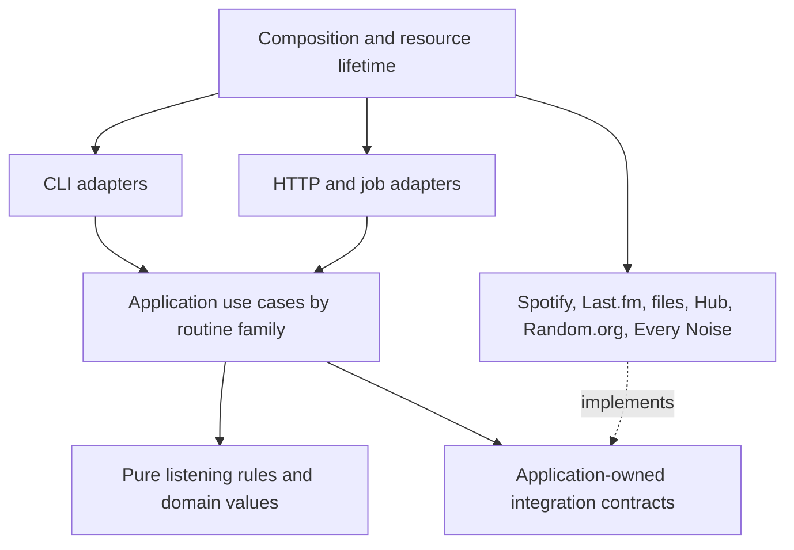

# Behavior-preserving Clean Architecture refactor

**Status: roadmap, item 1, and ADR-001 approved; item 2 implemented for review.**

Item 1 deliverables are in the [compatibility inventory](refactor/README.md),
including frozen interface snapshots and the accepted
[architecture decision](adr/001-refactor-boundaries-and-async-lifetimes.md).
Item 1 was deployed and merged in PR #60. Item 2's
[characterization and fault-injection evidence](refactor/CHARACTERIZATION.md)
is ready for review. Application refactoring has not started; later items remain
pending. Item 2 deployment and merge require the user's approval.

Audited on 2026-09-24 at commit `fbcfc65`. This proposal is based on source,
dependency, entry-point, test, and coverage inspection. No implementation,
configuration, or test files were changed during the audit. Existing changes to
`README.md`, `docs/README.md`, and `docs/ARCHITECTURE_SPEC.md` are left intact.

## 1. Measured baseline

| Measure | Result |
| --- | --- |
| Package | 74 Python files; 43,259 physical lines |
| Interfaces | 44 decorated CLI commands; 115 decorated API routes |
| Largest interfaces | `api.py`: 8,611 lines; `main.py`: 5,398 lines |
| Tests | 1,127 passed, randomized with seed `469517`, in 8.87 seconds |
| Statement coverage | 90.22%: 16,395 / 18,173 statements |
| Branch coverage | 74.43%: 3,805 / 5,112 branches |
| Combined statement/branch coverage | 86.75% |
| Ruff lint and formatting | Passed; 74 files formatted |
| Existing mypy configuration | Passed; 74 source files |

The audit ran pytest with `--cov-branch`, which the normal recipe does not use.
All tests passed, but that diagnostic command exited unsuccessfully because
combined coverage was below the configured 90% floor. The measured statement
coverage clears the existing statement-only floor. This distinction must remain
visible when branch coverage becomes a required gate.

There was one dependency warning about Starlette's TestClient/httpx integration.
Dependency upgrades should be assessed separately from structural changes.

Baseline reports from this audit are in `/tmp/spotify-refactor-baseline-tests.txt`,
`/tmp/spotify-refactor-baseline-coverage.json`, and
`/tmp/spotify-refactor-baseline-mypy.txt`. These temporary files are not durable
project documentation; the measurements above are the recorded baseline.

## 2. Audit findings and their implications

These are architectural findings and risks. Potential race conditions have not
been reproduced as production incidents.

| Priority | Evidence | Implication and proposed response |
| --- | --- | --- |
| High | `routines/new_kids.py:1644` has a 760-line `_flush_review_playlist`; `new_wine.py:1213` has a 707-line flush; `release_check.py:1346` has a 701-line runner. | Decisions, network calls, prompts, mutation order, checkpoints, and rendering are interleaved. Extract pure policies and explicit application workflows, preserving each side-effect boundary. |
| High | `client/__init__.py:311`, `RotatingSpotify._internal_call`, holds `_rotation_lock` across requests and retry sleeps. | Concurrent callers on one client serialize. Wrapping the same client in async tasks will not create concurrent Spotify I/O. Introduce an adapter boundary before replacing transport. |
| High | Cached clients in `api.py:1043–1069`; workers such as `_run_found_art_job` replace and later restore the shared client callback. | Concurrent jobs of different routines can interfere with callback ownership. Characterize interleavings and introduce job-scoped event delivery. Any correction to observable legacy behavior must be identified explicitly. |
| High | Retries exist in the client, `review_album_limits.retry_spotify_server_errors`, `analyse_library.spotify_call`, and interface callbacks. | Defaults, attempts, waits, cancellation, and mutation retries differ by path. Catalog those policies before consolidating their implementation; do not silently adopt one new policy. |
| High | Branch coverage is 74.43%; examples include composer helpers 57.50%, Queue 3 63.07%, Palace of Memory 65.97%, and library analysis 66.12%. | Overall line coverage is insufficient evidence for moving these stateful routines. Add decision tables and interruption/recovery tests before migrating each family. |
| Medium | `api.py:819`, `BlastJobResult`, contains a large set of unrelated optional result and choice fields; job workers repeat lifecycle handling. | Introduce typed internal job results and a shared runner, while preserving the existing external response envelope and status semantics. |
| Medium | `new_kids.py:1104`, `queue_3.py:632`, `sauvignon.py:301`, and `discography.py:516–659` call private helpers from other routines. | Shared business concepts have accidental owners. Extract only demonstrably shared policies; keep distinct routine rules separate. |
| Medium | `core/state/runtime.py` and `core/library_data/runtime.py` import concrete infrastructure and resolve process-wide services. Routines import these runtime helpers. | Existing store protocols are a useful foundation, but dependency direction is incomplete. Move construction to an outer composition module and inject services into workflows. |
| Medium | Raw/broad dictionaries and `Any` persist in state, payloads, retry callbacks, and results; mypy ignores missing imports globally. | A passing type check does not establish strong boundaries. Validate payloads at adapters and progressively require strict typing in domain/application code. |
| Medium | `processors/library_lookups.py` already batches contains and album calls; routines also maintain local caches. | Optimize measured repeated reads rather than assume all calls are unbatched. Unify paging and safe caching without weakening live freshness checks. |
| Medium | JSON writers, audit appends, path constants, and publishing calls occur inside routines; loaders print directly. | Separate storage, audit, presentation, and business responsibilities while preserving write timing, bytes where relevant, and visible messages. |

The command `analyse-library-async` currently means offline export analysis. It
is implemented synchronously. Its name and offline data-source semantics remain
unchanged when actual async Spotify I/O is introduced elsewhere.

## 3. Target architecture

Keep a single deployable modular monolith, organized around the listening rules.
Use functions and small immutable data classes for business logic; introduce
classes where they own state or resources. Avoid a generic workflow framework or
one interface per function.

Proposed package responsibilities:

| Package | Responsibility |
| --- | --- |
| `domain/` | Release identity and ordering, album evaluation, discovery/promotion rules, listening progress, historical selection, typed plans and outcomes. No HTTP, filesystem, UI, environment, or concrete SDK imports. |
| `application/` | Named routine use cases: gather facts, request decisions, apply policies, execute ordered effects, persist progress. Own narrow ports for catalog/library/playlist access, state, mirrors, history, audit, clock/randomness, and interaction. |
| `infrastructure/` | Implement those ports using Spotify transport/OAuth, Last.fm, Random.org, Every Noise, local JSON, and Hugging Face. Own parsing, serialization, paging, connections, and transport errors. |
| `interfaces/cli/` | Typer commands and Rich rendering/prompts, grouped by routine family. |
| `interfaces/http/` | FastAPI routers, wire schemas, presenters, errors, and job endpoints. |
| `bootstrap/` | Settings, explicit dependency construction, resource startup/shutdown, and compatibility wiring. |

Keep `main.py`, `api.py`, and `web.py` as stable launch facades. Preserve existing
public Python entry points with delegating compatibility functions where needed.
Existing state/data services should be reused and relocated only where their
responsibility requires it. Pydantic remains appropriate at validation and wire
boundaries; there is no need to replace every working model.

## 4. Compatibility contract

For identical input snapshots and user choices, retain:

- Selection, eligibility, ranking, tie-breaking, caps, thresholds, duplicates,
  artist-credit rules, release editions, canonical endpoints, and playlist order.
- CLI names, options, defaults, prompts, exit codes, and meaningful output;
  HTTP paths, methods, status codes, field names/defaults/nullability, and OpenAPI
  contracts; current frontend and automation expectations.
- Spotify mutation sequence, including replacement-before-removal behavior;
  live checks before mutation; checkpoint and audit order; resume/skip behavior.
- All current dry-run exceptions: some routines still write history, mappings,
  or logs. Build a per-command effect matrix rather than assume zero writes.
- State namespaces, schema versions, legacy import paths, JSON representations,
  conflict detection, data hashes, backups, publishing boundaries, and authority
  rules for live Spotify versus local/export data.
- Time zones, partial dates, year/season/week boundaries, Random.org timestamp
  semantics, error translation, retry limits, credential rotation, and cancellation
  boundaries, including existing differences between CLI and web.

Read-only request scheduling and elapsed duration may change to achieve the
requested async efficiency. Such changes are allowed only where they preserve
decision inputs, ordered results, effect traces, and externally meaningful event
ordering. Do not prefetch across a user decision or mutation if freshness matters.
When independence cannot be established, keep the operation sequential.

Disagreements between prose rules and current implementation, retry safety
problems, or existing race-condition fixes go into an explicit behavior-change
list. This refactor does not silently resolve them. No new durable job system,
database, public schema redesign, or production deployment is part of this plan.

## 5. Itemized implementation roadmap

Each numbered item is a reviewable milestone, often several small commits. Tests
and type improvements accompany every slice, not just the final milestone.

1. **Freeze the behavior and dependency inventory.**
   Record commands/routes, routine dependencies, settings aliases, storage
   formats, retry profiles, and external endpoints actually used. Map implemented
   listening rules to use cases and tests; distinguish unimplemented prose rules.
   Capture baseline OpenAPI and CLI help/output examples. Add a proposed ADR for
   the dependency direction and async lifetime model.
   **Exit:** a compatibility checklist covering all 44 commands and 115 routes.

2. **Build characterization and fault-injection coverage.**
   Extend the existing mutable Spotify fakes with ordered effect recording,
   scripted responses, pagination, and failures before/after external acceptance.
   Use fixed clocks, IDs, Random.org responses, scrobbles, and user choices.
   Capture result, mutation, prompt, checkpoint, mirror, and audit traces for each
   family. Compare old and extracted implementations against the same fixtures.
   Block unexpected outbound requests; redirect every writable artifact to
   temporary storage. Keep adapter parsing tests independent of domain fakes.
   **Exit:** the routine being moved has both normal and interruption/restart
   coverage, including its dry-run effect contract.

3. **Introduce domain types and extract pure policies.**
   Start with album keep decisions, release ordering/identity, track progression,
   primary-artist filtering, scrobble completion, promotion thresholds, and
   historical selection. Consolidate duplicated models only when their semantics
   match. Use typed decisions instead of magic string/dictionary combinations.
   Retain tolerant legacy parsing in boundary codecs; avoid introducing stricter
   validation as an accidental behavior change.
   **Exit:** extracted policies are pure, strictly typed, and tested without SDKs,
   files, application startup, or network access.

4. **Introduce integration ports and explicit composition.**
   Wrap the existing synchronous Spotify client first. Add narrow catalog,
   membership, playlist, state, mirror, history, interaction, and audit contracts
   based on actual use cases. Move runtime singleton/environment construction out
   of the inner layers. Reuse state compare-and-swap and library integrity logic.
   Preserve compatibility facades for callers and move tests gradually from
   monkeypatching private modules to injecting dependencies.
   **Exit:** a use case can run entirely against typed in-memory dependencies;
   production still uses the original transport and persistence semantics.

5. **Prove two complete vertical slices.**
   Migrate album evaluation first as a read-only slice. Then migrate Requeue for
   a Dream, extracting its required release-selection/progression policies from
   the existing shared helpers. Cover both CLI and HTTP adapters, typed result
   translation, dry run, mutation order, and resumed execution where supported.
   **Exit:** old/new differential fixtures agree, including partial failure.
   Adjust the architecture here before spreading it across the repository.

6. **Migrate the remaining routine families in dependency order.**
   Use the wave inventory below. In each routine separate gathering facts, pure
   decisions, interaction, ordered execution, and presentation. Break large
   functions at meaningful business stages. Keep ordinary functions where they
   are clearer than an object hierarchy. Extract shared behavior into a named
   domain/application service instead of importing another routine's private
   helper. Keep execution synchronous during this structural migration.
   **Exit per wave:** every original command and routine is accounted for, effect
   traces match, and unrelated routine internals are no longer dependencies.

7. **Decompose interfaces and centralize job mechanics.**
   Split CLI commands and HTTP routers/presenters by feature. Introduce a shared
   job lifecycle implementation with typed internal results/events and explicit
   interaction channels. Preserve the existing wide JSON envelope through a
   presenter. Retain status transitions, conflict responses, log limits, choice
   semantics, cancellation, and process-local lifetime. Test concurrent jobs and
   resource ownership before removing mutable shared callbacks.
   **Exit:** public schema/CLI snapshots match; domain code contains no rendering;
   job lifecycle tests cover every routine adapter.

8. **Implement native async Spotify transport behind the ports.**
   Use a pooled `httpx.AsyncClient` for the endpoint subset this application uses,
   with adapter contract tests against the synchronous baseline. Preserve request
   parameters, paging, market behavior, error mapping, OAuth scopes/caches,
   headless behavior, rotation order, and each retry profile. Put token refresh
   coordination around credential state rather than all request I/O. Keep any
   remaining blocking SDK/file operations outside the event loop with bounded
   execution; offloading Spotipy alone is only a transitional bridge.
   **Exit:** recorded HTTP-contract fixtures and failure scenarios agree; clients
   close correctly and credential refresh is coordinated under concurrent calls.

9. **Convert use-case execution and interaction to async.**
   Re-run the same migration waves through async ports, separately from policy
   extraction. Own the web runtime in application lifespan and the CLI runtime
   at one top-level entry boundary. Do not create clients on one event loop and
   reuse them on another. Replace blocking waits with awaited choices/retry
   waits; preserve safe checkpoint boundaries when cancellation arrives during
   an external write. Keep compatibility bridges at the outer edge until all
   callers are migrated.
   **Exit:** event-loop responsiveness, task cleanup, cancel/choice races, partial
   writes, and restart recovery pass deterministic tests.

10. **Optimize proven independent reads.**
    Measure request counts first. Reuse bounded connections; batch only supported
    endpoint operations; deduplicate repeated metadata lookups and simultaneous
    identical reads; use run-scoped caches with explicit invalidation. Apply
    bounded concurrency to independent catalog/history reads and preserve input
    order in returned results. Keep dependent cursor pagination and all ordered
    mutation/checkpoint sequences sequential. Observe per-app and endpoint rate
    limits and `Retry-After`; do not invent numeric quotas or expand credential
    rotation to increase throughput. Existing retry behavior differences must be
    documented before selecting compatible scheduling behavior.
    **Exit:** deterministic request-count/concurrency budgets improve or hold,
    results/effects remain identical, and throttling/cancellation tests pass.

11. **Finish strict typing and architecture enforcement.**
    Make domain/application typing strict; parameterize collections, preserve
    return types through retry helpers, narrow validated payloads, and isolate
    unavoidable third-party `Any` at adapters. Use Python 3.14 idioms consistently,
    context managers for resources, and precise names/docstrings. Add import
    boundary tests that prohibit inward dependencies on UI/infrastructure and
    private cross-routine calls. Make mypy and branch-aware tests explicit CI
    checks; the current repository workflow is primarily nightly automation.
    **Exit:** no broad new ignores/casts, no circular feature dependencies, and
    the coverage gates below are enforced.

12. **Complete compatibility verification and documentation.**
    Remove superseded internals only after all callers and tests use the new
    structure; retain public compatibility facades. Re-run randomized suites,
    differential fixtures, storage contracts, OpenAPI/CLI snapshots, web/automation
    smoke tests, packaging/entry-point checks, and async benchmarks. Update the
    architecture and developer guides with dependency rules and how to add a
    routine. Reconcile documentation with existing user edits before changing it.
    **Exit:** the completion criteria below hold, with remaining limitations and
    separately proposed behavior fixes clearly reported.

### Routine migration inventory for steps 6 and 9

| Wave | Modules and related responsibility | Behaviors needing special protection |
| --- | --- | --- |
| Foundation | `review_album_limits`, `recover_removed_albums`, shared lookup/model/processor policies | Keep thresholds, followed artists, future releases, local mirrors, stats, removed-album logs |
| Release progression | `new_wine`, `slow_listening`, `new_kids` (including Queue 2), `composer_playlists`, `queue_3`; finish Requeue integration | Canonical endpoints, liked streaks, editions, four-release/40-track cycles, promotions, prefills/postfills, annual import, crash recovery |
| History and discovery | `blast_from_past`, `scrobble_history`, `daily_mind_radio`, `found_art`, `sauvignon`, `release_check`, `blast_from_past_artists`, `the_queue`, `genre_reveal` | History merge/deduplication, weekly/seasonal boundaries, candidate rankings, live resolution, recommendation exclusions, release windows, rotation, genre order |
| Deep listening and retrospectives | `something_old`, `palace_of_memory`, `discography`, `new_year` | Golden Oldies, alphabetical cursors, Random.org selection, round-week packing, yearly ranks, annual idempotency |
| Library and legacy workflows | `analyse_library`, `review_artists`, `convert_library_file`, `monthly_routine`, `count_items`, remaining processors/loaders | Live versus export authority, paging reconciliation, staging/backups, recovery, prompts, legacy outputs |
| Operational integration | `upload_library_files`, auth/settings wiring, nightly automation, startup/web wrapper | Exact upload manifests, token-cache behavior, password gating, hydration/publishing and deployment entry points |

Shared prerequisites may be extracted earlier without migrating their owning
workflow. Each module must have an explicit destination; small and legacy
commands are included rather than left behind in the old dependency structure.

## 6. Test strategy and completion gates

| Area | Tests and representative cases |
| --- | --- |
| Pure policies | Table-driven boundaries and property tests: exact keep/promotion thresholds; fewer than four eligible releases; ties and edition normalization; canonical truncation; primary-artist credits; zero tracks; deterministic order. |
| Application workflows | Stateful fakes and differential scenarios: identical choices/results/effects; existing target/source absent; cap boundaries; duplicate markers; multiple artists; resume after each recorded effect. |
| Failure recovery | Fail before and after accepted Spotify writes, after add/before remove, after remove/before checkpoint, during audit/mirror/Hub publication, and during conflicting state writes. Preserve current outcome, even if it exposes a separate improvement opportunity. |
| Async transport | Mock HTTP contracts: short/empty/malformed pages, unavailable items, partial/null payloads, 401 refresh, all-app 429 exhaustion, `Retry-After`, 5xx, timeouts, ambiguous mutation results, and current retry counts. |
| Concurrency | Controlled barriers/fake clocks: bounded in-flight requests, one coordinated refresh, cancellation during backoff/choice/write, no leaked tasks, per-job events, deterministic result ordering. Avoid timing-sensitive sleeps. |
| Persistence | One contract suite for local and mocked Hub stores: compare-and-swap, namespace merge/conflict, checksums, legacy documents, unknown fields, exact serialization where consumed, atomic writes and failed publication. |
| Interfaces | CLI prompts/options/defaults/exits; HTTP payload/OpenAPI parity; job transitions and 409 behavior; frontend polling/choice/cancel/reconnect and password wrapper; automation API assumptions. |
| Performance | Fixed fixtures measuring calls per operation, peak concurrency, cache scope, and repeated fetches; simulated network latency to demonstrate overlap. Report wall-clock measurements without using fragile speed thresholds as correctness gates. |

Proposed final gates:

1. All existing tests remain represented by equivalent or stronger assertions;
   all compatibility/differential scenarios pass. Do not merely rewrite expected
   outputs to match the new implementation.
2. At least **95% statement and 90% branch coverage package-wide**, with **98%
   statement and 95% branch coverage for domain/application modules**. Ratchet
   coverage upward per migrated family; keep at least the 90.22% statement
   baseline during migration. Check line and branch metrics separately.
3. Every identified decision-table boundary and mutation/recovery boundary has a
   test regardless of percentage. Use targeted mutation testing for thresholds,
   ordering, and promotion conditions to assess assertion strength.
4. No coverage inflation through added exclusions, deleting low-coverage modules
   from measurement, or blanket type-check suppression. Existing exclusions are
   reviewed as their modules move.
5. Ruff, formatting, strict inner-layer mypy, adapter typing, import boundaries,
   randomized tests, wire/storage compatibility, and async resource tests pass.
6. No production data or credentials are required by the test suite. Any optional
   live read-only smoke test is separate; no live writes are part of verification.
7. Every optimization has a request-count or scheduling rationale and parity
   evidence. No claimed live speedup without a representative measurement.

Coverage and differential tests give strong regression evidence; they do not
mathematically prove identical behavior for every possible live-service response.
Ambiguous cases are documented and retained as sequential/legacy behavior until
their compatibility can be established.

## 7. Technical references

- [Spotify rate limits](https://developer.spotify.com/documentation/web-api/concepts/rate-limits): rolling-window and endpoint-specific limits, `Retry-After`, and batch/request-reduction guidance.
- [HTTPX async support](https://www.python-httpx.org/async/): pooled async clients and explicit resource lifetime.
- [Python asyncio tasks](https://docs.python.org/3/library/asyncio-task.html): structured task lifetime, cancellation, and blocking-I/O bridges.

## 8. Approved delivery workflow

The user approved the architecture, migration order, compatibility definition,
and coverage targets on 2026-09-24. For every roadmap item:

1. Start from clean, current `master` and create a dedicated branch.
2. Implement, verify, and commit the changes for that item.
3. Open a GitHub pull request for user review.
4. Wait for the user's approval.
5. After approval, deploy to Hugging Face and verify the deployment, then merge
   the pull request.
6. Clean up the item's branch and any temporary worktree, return to clean,
   current `master`, and only then proceed to the next item. Preserve unrelated
   user files and changes.

Before item 1, open and merge a preparatory PR containing this roadmap and the
other pending documentation changes. The user has explicitly authorized that
merge. Return to a clean `master`, notify the user, and wait for their instruction
before beginning item 1. The workflow is also recorded in `AGENTS.md` for future
sessions.
