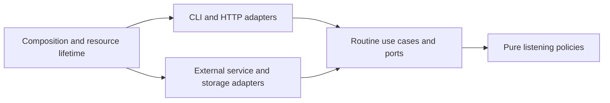

# ADR-001: routine-centered boundaries and async resource ownership

**Status:** proposed for item 1 review; implementation follows the approved roadmap.

**Date:** 2026-09-24

**Decider:** repository owner, through the item 1 pull request.

## Context

Spotify Manager implements listening policies through CLI, HTTP jobs, and a web
cockpit. Rules, SDK payloads, prompts, retries, files, and checkpoint writes share
large routine functions. Several routines depend on private helpers in another
routine. Storage ports already exist but runtime factories inside `core` import
concrete infrastructure. See the [frozen dependencies](../refactor/baseline/routine-dependencies.md).

The current Spotipy client serializes requests and retry waits behind one lock.
Web jobs use threads and cached clients with mutable callbacks. Simply changing
function declarations to `async def` would retain blocking I/O and introduce
resource-lifetime and cancellation hazards. Yet mutation and checkpoint ordering
must remain unchanged, including incomplete operations and restart behavior.

The application remains a single-operator modular monolith with local files and
Hugging Face datasets. Existing CLI names, HTTP schemas, state formats, and
headless/interactive authentication are compatibility requirements.

## Decision

Adopt the following dependency direction, incrementally:

Domain modules contain typed values, selection/evaluation policies, and pure
transitions. They do not import application, infrastructure, UI, settings, or
concrete SDKs. Application modules own narrow integration ports and named use
cases, sequencing reads, decisions, prompts, mutations, audits, and checkpoints.
Application code may compose explicitly public use cases when a larger routine
requires it, but cannot borrow private helpers from another routine.

Infrastructure implements the ports. Interface adapters parse input, present
output, and translate errors. An outer composition module constructs dependencies
and owns startup/shutdown; core modules cannot locate production singletons.
Retain existing models where useful and avoid abstractions without multiple
callers or a meaningful external boundary.

The first adapters wrap the current synchronous implementation. Extract policies
and use cases before introducing native async transport. Keep structural moves,
async conversion, and efficiency changes in separate reviewable milestones.

### Async lifetime model

- The web app's lifespan owns its event loop's pooled async clients, application
  services, and job registry. Track job tasks explicitly. No global async client
  may survive an event-loop teardown or be reused on another loop.
- A CLI invocation creates one top-level async runtime after parsing input and
  closes clients before it exits. Do not call `asyncio.run` inside a routine or
  use a request-scoped client for a background job that outlives the request.
- A job owns its cancellation signal, user-choice channel, and event sink. Keep
  the current externally visible state machine and response presenter; internal
  typed job results do not change the existing broad wire envelope.
- OAuth/credential refresh has explicit coordination scoped to the applicable
  credential state. It must not hold a global lock across unrelated request I/O
  or delay sleeps. Keep token caches, rotation ordering, scopes, and CLI versus
  headless behavior compatible.
- Use a pooled native async Spotify adapter for the endpoint subset in the
  [inventory](../refactor/baseline/spotify-endpoints.json). Use bounded offloading
  only for remaining blocking SDK/file work. A legacy sync bridge belongs at the
  application edge and is removed only after its callers are migrated.
- Use structured task lifetime and bounded concurrency for demonstrably independent
  reads. Preserve result order and failure-selection semantics; canceling sibling
  tasks must not change a routine's chosen error or leave resources running.
  Cursor pagination and decisions dependent on fresh user/library state stay
  sequential unless equivalence is demonstrated.
- Writes, mirror reconciliation, and checkpoints retain their existing order.
  Cancellation is a request to stop at the existing safe boundary, not permission
  to abandon an accepted remote write. Record/reconcile the outcome before ending
  the job, using the current routine's recovery semantics. Thread offloading does
  not make a blocking write cancelable.
- Retain process-local job lifetime. A durable worker system, new restart
  guarantees, and distributed locks require separate decisions. Client shutdown
  must not silently introduce a new externally visible job protocol.

## Options considered

| Option | Complexity | Benefits | Costs |
| --- | --- | --- | --- |
| Split large files only | Low initially | Small diffs; existing execution unchanged | Leaves business rules coupled to concrete services and threads; weak foundation for async and isolated testing. |
| Incremental ports/policies/use cases, then async adapters | Moderate, spread across milestones | Behavior can be compared at every step; transports replaceable; clear resource ownership | Temporary compatibility facades and additional wiring; synchronous and async paths coexist during migration. |
| Replace all routines with a generic async workflow engine | High | Common execution machinery | Large simultaneous behavior surface; abstractions obscure distinct rules; recovery and public contracts harder to preserve. |

Choose the middle option. Reuse a shared job runner for actual common lifecycle
mechanics, not a general-purpose business workflow engine. Prefer functions and
immutable data classes; reserve stateful objects for services and resource owners.

## Consequences and compatibility limits

Business policies become directly testable, boundary payloads become typed, and
safe reads can overlap. More explicit dependencies and temporary adapters add
short-term code. Frozen interface snapshots and differential effect traces are
required before removing the old implementation for a slice.

Async changes timing. Equivalence is defined for identical snapshots and user
choices: same decisions, ordered mutations, relevant events, persisted formats,
and recovery behavior. Reads whose scheduling changes freshness must remain
sequential. Potential bugs such as callback races, ambiguous write retries, and
specification disagreements are tracked in [CONTRACTS.md](../refactor/CONTRACTS.md);
fixing observable behavior requires explicit review rather than inclusion by
accident in this refactor.

## Action items

1. [x] Freeze command, route, source dependency, configuration, and integration
   inventories with an offline capture/check command (item 1).
2. [ ] Add characterization and fault-injection scenarios (item 2).
3. [ ] Extract pure domain policies and production adapters behind ports (items 3–4).
4. [ ] Prove vertical slices and migrate the remaining families (items 5–6).
5. [ ] Consolidate interface/job ownership without schema changes (item 7).
6. [ ] Implement async transport and execution with compatibility evidence (items 8–9).
7. [ ] Optimize proven independent reads and enforce dependency boundaries (items 10–11).

## References

- [Approved roadmap](../REFACTOR_ROADMAP.md).
- [Python 3.14 tasks and cancellation](https://docs.python.org/3/library/asyncio-task.html).
- [HTTPX async client lifetime](https://www.python-httpx.org/async/).
