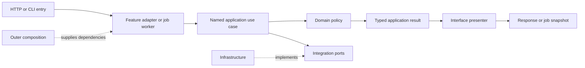

# Item 7a: simplify internal call paths

**Status:** implemented and ready for PR review on `codex/refactor-07a-direct-use-cases`,
starting from clean Item 7 merge `7fe292c`. Deployment and merge await approval. The architectural direction and added
roadmap item were approved on 2026-10-03. Item 8 waits for the Item 7a release.

Item 7 PR #66 was approved, deployed to Space revision
`702365bae980a4a7f0036f36bb24a7f4239d5cfc`, and merged. All 155 deployed paths
matched the approved source; durable state/data revisions were unchanged.
Production check-only runs `37125691360` and `37126187525` passed before and
after deployment, including all 20 active-job endpoints. The four local runtime
data changes were preserved in a named stash; older stashes remain intact.

The decision is recorded in [ADR 003](../adr/003-direct-use-case-paths.md).
The frontend remains part of compatibility verification; restructuring its
HTML, CSS and JavaScript is reserved for a future targeted refactor.

## Implementation order

1. Inventory each family in the [roadmap migration inventory](../REFACTOR_ROADMAP.md#routine-migration-inventory-for-steps-6-and-9).
   Record HTTP and CLI entries, worker dispatch where applicable, the named
   application use case, policies, integrations and result presenter. Mark each
   compatibility seam as public, internal, or a justified temporary exception.
2. Simplify the album-evaluation path first. Separate dependency construction
   from use-case invocation and wire both HTTP and CLI adapters directly to the
   application operation. Keep the legacy public evaluation helper callable.
3. Simplify Sauvignon next. Retain its worker-owned choice/cancellation signals
   and presenters while removing the routine/bootstrap forwarding detour from
   normal execution. Verify choices, retries, effect boundaries and cleanup.
4. Apply the same approach to the remaining routine families, analysis and
   operational commands. Resolve bootstrap/infrastructure lookups back into
   routine globals; use explicit dependencies and default implementations.
5. Remove superseded internals only after both direct and compatibility entry
   paths have equivalent or stronger behavior coverage. Keep public imports,
   framework metadata and supported override boundaries.
6. Update the family request/return map and add focused dependency checks. Run
   the full verification gates, start the local web environment and open the
   dedicated PR. Obtain approval before deploying or merging.

## Following a request and its result

Start with the frontend's request URL in `frontend/index.html`. Match it in
`interfaces/http/routers/`, then follow the named `api.py` registration into
`interfaces/http/handlers/`. A job handler reserves its handle and dispatches
its feature worker; that worker supplies its own choice, retry, progress and
cancellation callbacks to the operation below. CLI commands in `main.py` supply
the same operation to `interfaces/cli/features/`.

`interfaces/operations/` contains invocation functions shared by CLI and HTTP.
They assemble existing typed dependencies and call application stages. The
business decision stays in `application/` and `domain/`; the invocation function
does not choose tracks or change effect order. `bootstrap/` supplies concrete
catalog, file and state dependencies. Construction does not advance a workflow.
Some operations must read inputs between stages; those observations retain their
original order and resource scope.

For album evaluation, follow this complete path:

```text
frontend/index.html: album request
  → interfaces/http/routers/lookups.py
  → api.album_evaluation → LookupsHandlers.album_evaluation
  → interfaces/lookup_operations.evaluate_live_album
      constructs catalog and membership through bootstrap.listening
  → application.album_review.review_album
  → domain.albums.assess_album
  ← AlbumReview
  → interfaces/presenters/albums.album_evaluation
  ← AlbumEvaluation → HTTP response
```

The CLI's `LookupsCLI` uses the same `evaluate_live_album` invocation and result.
The public processor helper remains an external compatibility entry; normal
CLI/HTTP execution does not call it.

## Family request and return map

Paths in the operation column are relative to `spotify_manager/interfaces/`.
HTTP workers are in `http/workers/`, CLI adapters in `cli/features/`. Returned
application values go to the named HTTP presenter, or to the CLI adapter's Rich,
JSON or print rendering. Registration, slot reservation and polling remain
interface mechanics, separate from policy execution.

| Family / feature adapter | Shared operation | Application stages and domain rules | Return path |
| --- | --- | --- | --- |
| Album, artist and track lookups: `lookups` | `lookup_operations.py`: `evaluate_live_album`, `get_live_artist_library_stats`, `get_track_scrobble_status` | `album_review`, `library_lookup_run`, `scrobble_lookup_run`; `albums`, `lookup_selection`, `lookup_seasons` | `AlbumReview` → album presenter → `AlbumEvaluation`; existing statistics/status wire models → handler or CLI |
| Blast: `historical`, `blast` | `operations/blast_from_past.py` | `BlastSelection`, `BlastPlaylist`, `HistoricalResolution`; calendar and historical matching policies | Historical summary → `http/presenters/historical.py` → job snapshot; CLI historical renderer |
| Daily Mind Radio: `daily_mind_radio`, `historical` | `operations/daily_mind_radio.py` | `AnniversarySelection`, `AnniversaryPlaylist`, `HistoricalResolution`; anniversary and matching rules | Daily summary → historical presenter → job snapshot; CLI historical renderer |
| Dormant artists: `dormant`, `blast_artist`, `historical` | `operations/blast_from_past_artists.py` | `DormantRecovery`, `DormantLikedTrack`; dormant-year intersection and preferred liked track | Dormant summary → historical presenter → job snapshot; CLI historical renderer |
| Found Art: `found_art` | `operations/found_art.py` | `RecommendationRun`, seed/candidate/resolution stages; recommendation history, ranking and matching | `FoundArtSummary` → recommendations presenter → job snapshot; CLI recommendation rendering |
| Sauvignon: `sauvignon` | `sauvignon_operations.py` | `SauvignonRun`, album gathering and selection; album recommendation and selection policies | `SauvignonSummary` → recommendations presenter → job snapshot; CLI Sauvignon rendering |
| Queue fill: `queue_fill`, `queue` | `operations/the_queue.py`: `fill_queue_from_lastfm` | `QueueFill`, `QueueSeeds`, `QueueRecommendations`, artist mapping; seed/ranking/exclusion rules | Fill summary → queue presenter → job snapshot; CLI queue renderer |
| Queue flush: `queue_flush`, `queue` | `operations/the_queue.py`: `flush_queue` | `QueueFlush`, planning/execution; artist assessment, top-track progression and accepted-effect rules | Flush summary → queue presenter → job snapshot; CLI queue renderer |
| New Kids and Queue 2: `discovery`, `new_kids`, `queue_2` | `operations/new_kids.py` | Review inputs → discovery session/planner/execution → `DiscoveryReview`; Queue 2 prefill retains its separate stage | Discovery/Queue 2 summary → discovery presenter → job snapshot; CLI discovery renderer |
| Queue 3: `queue_3` | `operations/queue_3.py` | Annual input observations/import → `Queue3Run`/`Queue3Review` → completion; annual import and studio progression policies | Annual/flush summary → queue presenter → job snapshot; CLI Queue 3 presenter |
| New Wine: `wine`, `new_wine` | `operations/new_wine.py` | New Wine planning/observations/execution, Wine Cellar refill; release progression and library affinity | New Wine summary → wine presenter → job snapshot; CLI wine renderer |
| Slow Listening: `slow_listening` | `operations/slow_listening.py` | Slow-listening plan/run/state; chronological studio-release progression | Slow summary → slow-listening presenter → job snapshot; CLI slow renderer |
| Something Old: `something_old` | `operations/something_old.py` | `SomethingOld`, golden selection and artist mapping; Golden Oldies and track-selection rules | Golden summary → Something Old presenter → job snapshot; CLI golden renderer |
| Release check: `releases`, `release_check` | `operations/release_check.py` | `ReleaseRunOpening` → release-review/run stages; windows, ranking, pending singles and destinations | `ReleaseCheckSummary` → releases presenter → job snapshot; CLI release renderer |
| Palace: `palace`, `palace_of_memory` | `operations/palace_of_memory.py` | Saved-album mirror/history/cursor → `PalaceRun`; alphabetical and historical planning | Palace summary or cursor → historical presenter/handler → snapshot/response; CLI palace renderer |
| Discography: `discography` | `operations/discography.py` | `DiscographyPlanning` and `DiscographyExecution`, catalog/queues/history; priority and week-size selection | Plan/summary → discography presenter → job snapshot; CLI release-selection tables |
| Annual retrospective: `new_year` | `operations/new_year.py` | New Year sources/plan/resolution/execution; annual charts and checkpointed marker stages | Original result dictionary → worker snapshot or CLI rendering |
| Genre: `genre` | `operations/genre_reveal.py` | `GenreReveal`, source discovery and progress; genre route/state rules | Completed genre result → genre handler or CLI; web completion state retains its separate adapter |
| Artist review: CLI `artist_review` | `operations/review_artists.py` | Artist review session/catalog/decisions/run/completion; library/queue eligibility and recovery | Review summary → CLI review tables and prompts |
| Album limits and recovery: CLI `album_review`, `recovery` | `operations/review_album_limits.py`, `operations/recover_removed_albums.py` | Album-limit/recovery workflows and credited-artist effects; album decisions and future-release recovery | Typed review/recovery summary → CLI presenters |
| Requeue: `requeue`, `requeue_for_a_dream` | `operations/requeue_for_a_dream.py` | `flush_requeue`; marker identity and chronological progression | Requeue summary → historical presenter → job snapshot; CLI requeue rendering |
| History: `history`, `scrobble_history` | `operations/scrobble_history.py` | `HistoryRefresh`; history merging and accepted publication order | History summary → historical presenter → job snapshot; CLI history renderer |
| Mirror analysis: `analysis`, `analysis_worker` | `operations/analyse_library.py` | Checkpoint/session/resource scans/export/publication; mirror records, continuation and reconciliation | Sync summary → analysis presenter/worker → result; CLI analysis output |
| Upload: CLI `library_upload` | `operations/upload_library_files.py` | Upload plan/materialization/publication; path and part-manifest rules | Plan/summary → CLI upload rendering |
| Legacy maintenance: `library_commands` | `operations/legacy_library.py` | Comparison/conversion/restoration/count, monthly control/statistics/playlist, incremental album refresh; legacy cursor/batching/statistics | Original None/count/albums → CLI output or existing synchronous HTTP response |

The before paths were adapter → routine/processor forwarding entry → bootstrap
execution helper → application. Both supported public compatibility entry points
and normal CLI/HTTP entries now converge on the shared operation. Infrastructure
binds concrete functions explicitly; it does not locate its execution dependencies
by looking up mutable routine/processor module globals.

## Ownership after simplification



Keep dependency construction at the scope the resource needs. Shared resources
may be initialized at startup; a job's interaction state and callbacks are owned
by that invocation. Do not turn synchronous resources into new global singletons
or change when clocks, settings, source snapshots or credentials are observed.
Async client/task ownership remains Items 8–9.

## Acceptance and evidence

- Every command/routine family has an explicit entry, use case, policy and return
  path. A reviewer can follow it without a generic dispatcher or service locator.
- After entering the feature adapter, normal internal execution does not detour
  through API/CLI or legacy routine/processor facades. Any retained exception has
  a named contract, justification and removal or retention decision.
- Each retained wrapper performs distinct validation, construction, interaction,
  business sequencing or presentation. Meaningful application stages remain;
  helper count and file count are not success metrics.
- Public entry points, signatures, imports, override behavior and all 11 frozen
  artifacts remain compatible. Original fixtures and their expected effects
  remain unchanged; internal test wiring may migrate only with equal or stronger
  coverage of the same behavior.
- Direct and compatibility entry paths are covered for success, validation,
  retries, choices, cancellation, accepted writes, checkpoints and failure
  recovery where applicable. Compare ordered results, effects and relevant events.
- Existing job evidence still covers conflicts, registry locks, dispatch failure,
  snapshot isolation, callback restoration and concurrent choice/cancellation.
- The full randomized suite, Ruff, typing and structural checks pass. Retain the
  approved 95% statement / 90% branch package gates and 98% / 95% inner-layer
  gates. Add focused checks for newly eliminated dependency detours; human
  readability review remains necessary.
- Local web integration checks cover health, data/state, job polling, choices,
  cancellation, reconnecting and password gating. Tests use offline fixtures and
  fakes; the local smoke check does not require live Spotify mutations.

## Retained boundaries and removal decisions

- **Public compatibility entries:** keep original routine/processor imports,
  signatures, defaults and schema text. Entry functions delegate to the shared
  operation. These wrappers serve external callers; bootstrap and infrastructure
  must not call them. The dependency regression guard enforces that distinction.
- **Original SDK source contract:** concrete read/write leaves remain in their
  original source files because the frozen SDK inventory includes source paths
  and receiver expressions. Explicit imports bind those implementations. Keep
  these leaves through Items 8–9; asynchronous replacements require the approved
  transport migration and equivalent ordered-call evidence, rather than silently
  moving a frozen expression in Item 7a.
- **File, codec and validation contracts:** helpers that implement actual file
  formats, state compatibility, resource validation or interface parsing retain
  those distinct responsibilities. Bootstrap now binds file functions at their
  concrete owners. Keep the supported helper imports; internal execution must not
  re-enter a primary routine merely to reach a business use case.
- **Clock/settings observation contracts:** original module clocks, live legacy
  settings, limits and default values remain where moving their observation
  would change timing or public defaults. Builders defer those reads to the
  original stage. Keep these observations through async migration and explicitly
  pass new lifetime dependencies when that migration addresses their ownership.
- **Threaded job ownership:** workers still own choice/cancellation signals and
  callback cleanup. Keep these meaningful contexts under ADR 002. Native async
  clients and tasks belong to Items 8–9.

The [named helper inventory](RETAINED_LEGACY_HELPERS.md) identifies every explicit
legacy helper binding, its family contract and retention decision. These are
concrete implementations or compatibility exports, not a generic dispatch layer.

## Verification record

Internal fixture substitutions moved from forwarding globals to the same typed
ports and concrete effect owners used by normal execution. Existing fixture
bytes, expected results, ordered effects, error prefixes, checkpoints and restart
recordings were not changed. New tests reject execution-facade dependencies and
mutable facade-function lookup, prove aliases/re-exports are detected, and cover
fresh-process entry import orders.

Final verification on the complete implementation:

- **10,387 tests passed**, randomized seed `20261013`.
- Package statement coverage: **96.16%** (30,965 / 32,203); branch coverage:
  **92.54%** (5,371 / 5,804). Both exceed the approved 95% / 90% gates.
- Domain/application statement and branch coverage remains **100%**. Separate
  isolated gates passed **1,201 domain** and **3,622 application** tests.
- Ruff and formatting pass; package mypy passes **605 files**. The six new
  dependency/fixture modules also pass strict mypy.
- The structural audit reports no local functions/classes, compound or multiline
  comprehensions, missing annotations, functions above 25 executable statements,
  or control nesting above two in changed/new production functions. Declaration
  imports and docstrings are excluded from executable-statement counts.
- A fresh capture matches all **11 frozen public artifacts**, without modifying
  baseline artifacts, SDK inventories or existing expected behavior fixtures.
- The 14 new dependency/startup checks pass as part of the full randomized suite.
  They reject inward execution through legacy facades and mutable function
  lookups, including re-exported file functions and deferred aliases.
- Local review server: **http://127.0.0.1:8766/**, restarted on the final branch.
  Health is online, **4 / 4 sources** and shared state load, and all **20 job
  reconnect endpoints** return 200 with no active jobs. Unlock, reload and job
  polling were checked in the browser. This local loopback preview has no
  configured password; enter any non-empty text to unlock. Offline integration
  tests preserve the configured-password, choices and cancellation contracts.
  No live routine or Spotify mutation was initiated by these smoke checks.

The four hydrated local runtime-data files are excluded from the implementation
commit and retained for review. The previous Item 7 release stashes remain intact.
This item keeps synchronous transport and the existing frontend source layout;
Items 8–9 handle async transport and lifetime ownership after approval/release.
