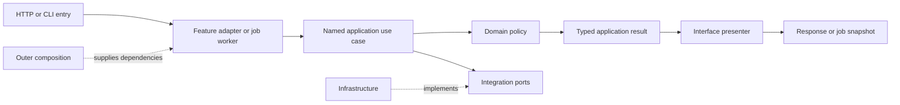

# Item 7a: simplify internal call paths

**Status:** architectural direction and added roadmap item approved on 2026-10-03;
implementation has not started. Item 7 PR #66 is still awaiting review approval.
After its deployment, verification, merge and cleanup, start Item 7a on a dedicated
branch from current `master`. Item 8 waits for the Item 7a release.

The decision is recorded in [ADR 003](../adr/003-direct-use-case-paths.md).
The frontend remains part of compatibility verification; restructuring its
HTML, CSS and JavaScript is reserved for a future targeted refactor.

## Implementation order

1. Inventory each family in the [roadmap migration inventory](../REFACTOR_ROADMAP.md#routine-migration-inventory-for-steps-6-and-9).
   Record HTTP and CLI entries, worker dispatch where applicable, the named
   application use case, policies, integrations and result presenter. Mark each
   compatibility seam as public, internal, or a justified temporary exception.
2. Simplify the album-evaluation path first. Separate dependency construction
   from use-case invocation and wire both HTTP and CLI adapters directly to the
   application operation. Keep the legacy public evaluation helper callable.
3. Simplify Sauvignon next. Retain its worker-owned choice/cancellation signals
   and presenters while removing the routine/bootstrap forwarding detour from
   normal execution. Verify choices, retries, effect boundaries and cleanup.
4. Apply the same approach to the remaining routine families, analysis and
   operational commands. Resolve bootstrap/infrastructure lookups back into
   routine globals; use explicit dependencies and default implementations.
5. Remove superseded internals only after both direct and compatibility entry
   paths have equivalent or stronger behavior coverage. Keep public imports,
   framework metadata and supported override boundaries.
6. Update the family request/return map and add focused dependency checks. Run
   the full verification gates, start the local web environment and open the
   dedicated PR. Obtain approval before deploying or merging.

## Representative current paths

These are observations of the Item 7 implementation, not the completed target.

| Operation | Current execution path | Simplification target |
| --- | --- | --- |
| HTTP album evaluation | Lookup router → `api.album_evaluation` → `LookupsHandlers.album_evaluation` → `processors.library_lookups.evaluate_album_live` → `bootstrap.albums.evaluate_live_album` → `application.album_review.review_album` → `domain.albums.assess_album` | Keep the framework boundary; give the feature adapter the application operation and catalog/membership dependencies. Return `AlbumReview` to the interface presenter. |
| CLI album evaluation | `main` command → `LookupsCLI._album_decision` → the same processor/bootstrap helpers → application/policy | Share the application operation with HTTP; keep CLI-specific errors and JSON presentation in the CLI adapter. |
| Sauvignon job execution | API start/reservation/dispatch → `SauvignonWorker._execute` → `routines.sauvignon.fill_sauvignon_from_lastfm` → `bootstrap.sauvignon.run_sauvignon` → `application.sauvignon_run.SauvignonRun.run` | Construct the application workflow at the invocation boundary and let the worker invoke it directly with its owned interaction callbacks. Present typed results in the worker's interface layer. |
| Library analysis | API dispatch → `AnalysisWorker.execute` → `routines.analyse_library` → bootstrap session/publication factories → application analysis stages; factories resolve file/clock callbacks through the routine module | Keep meaningful analysis stages and recovery boundaries. Wire their file/catalog/publication dependencies explicitly without execution returning through the routine facade. |

Routers register endpoints; registration itself is not an extra business step.
Infrastructure calls remain necessary to gather observations and apply effects.
The inventory must include the return path as well as the forward call chain.

## Target ownership

Keep dependency construction at the scope the resource needs. Shared resources
may be initialized at startup; a job's interaction state and callbacks are owned
by that invocation. Do not turn synchronous resources into new global singletons
or change when clocks, settings, source snapshots or credentials are observed.
Async client/task ownership remains Items 8–9.

## Acceptance and evidence

- Every command/routine family has an explicit entry, use case, policy and return
  path. A reviewer can follow it without a generic dispatcher or service locator.
- After entering the feature adapter, normal internal execution does not detour
  through API/CLI or legacy routine/processor facades. Any retained exception has
  a named contract, justification and removal or retention decision.
- Each retained wrapper performs distinct validation, construction, interaction,
  business sequencing or presentation. Meaningful application stages remain;
  helper count and file count are not success metrics.
- Public entry points, signatures, imports, override behavior and all 11 frozen
  artifacts remain compatible. Original fixtures and their expected effects
  remain unchanged; internal test wiring may migrate only with equal or stronger
  coverage of the same behavior.
- Direct and compatibility entry paths are covered for success, validation,
  retries, choices, cancellation, accepted writes, checkpoints and failure
  recovery where applicable. Compare ordered results, effects and relevant events.
- Existing job evidence still covers conflicts, registry locks, dispatch failure,
  snapshot isolation, callback restoration and concurrent choice/cancellation.
- The full randomized suite, Ruff, typing and structural checks pass. Retain the
  approved 95% statement / 90% branch package gates and 98% / 95% inner-layer
  gates. Add focused checks for newly eliminated dependency detours; human
  readability review remains necessary.
- Local web integration checks cover health, data/state, job polling, choices,
  cancellation, reconnecting and password gating. Tests use offline fixtures and
  fakes; the local smoke check does not require live Spotify mutations.

Record before/after family paths and necessary exceptions in this guide during
implementation. This document currently defines work and acceptance criteria;
it does not claim that the implementation has passed them.
